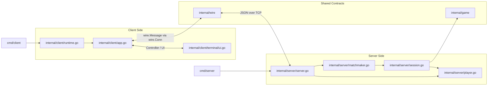
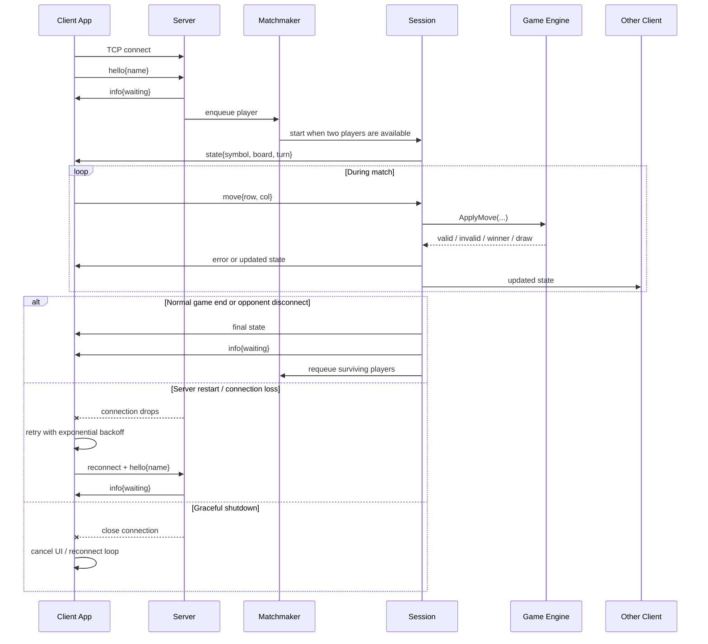

# Tic-Tac-Toe over TCP

This repository contains a small Go solution for playing tic-tac-toe over the network with two binaries:

- `server`: accepts connections, matches waiting players, and runs authoritative game sessions.
- `client`: connects to the server and delegates presentation/input to a pluggable UI.

## Architecture

The code is split so transport, game rules, and presentation are isolated:

- `internal/game` exposes a small `Engine` interface. The server runs against that interface, so tic-tac-toe can be swapped for another game implementation without rewriting session orchestration.
- `internal/client` owns the networking lifecycle and exposes a `UI` interface. The client binary now just wires a concrete frontend into the app.
- `internal/client/terminal` is one UI implementation. A desktop or web UI can be added by implementing the same interface and reusing the existing client networking package.
- `internal/wire` defines the shared message contract and a small transport abstraction. The current concrete implementation uses JSON over TCP, but the runtime now depends on a narrow `wire.Conn` interface instead of a JSON-specific type.



Logical flow:

1. `cmd/client` parses flags and starts the client runtime with a concrete UI.
2. `internal/client/app.go` manages connection lifecycle, reconnects, and move submission.
3. `internal/wire` carries typed messages between the client and server over TCP.
4. `internal/server/server.go` accepts connections and turns them into `Player` instances.
5. `internal/server/matchmaker.go` pairs waiting players and starts a `Session`.
6. `internal/server/session.go` runs one authoritative match against the `game.Engine`.



## Concurrency and Resilience

- `context`
  - used on both client and server for graceful shutdown and cancellation
  - the client also uses it to stop reconnect backoff loops immediately during exit
- `channels`
  - used for matchmaking and player/session message flow
  - this keeps the server coordination model event-driven and reduces shared mutable state
- `mutexes`
  - used in the client runtime and terminal UI to protect shared state across goroutines
  - used in `internal/wire` to serialize concurrent writes to a single network connection
- `wait groups`
  - used by the server so shutdown waits for the matchmaker, connection handlers, player read loops, and active sessions to exit before returning
- `reconnect strategy`
  - the client retries with exponential backoff when the server is unavailable
  - after a server restart, clients reconnect and return to the waiting queue
- `authoritative server`
  - the server validates moves and owns the game state, which keeps gameplay correct even if the client UI sends invalid or duplicated input

## Protocol

The client and server exchange JSON messages over a TCP connection. The first client message must be:

```json
{"type":"hello","name":"alice"}
```

Subsequent move messages look like:

```json
{"type":"move","row":0,"col":2}
```

The server responds with state updates that include the board, the client's symbol, whose turn it is, and the current game status.

## Build

```bash
go build ./cmd/server
go build ./cmd/client
```

On Unix-like systems, you can also use:

```bash
make build
```

Run the test suite with:

```bash
go test ./...
```

## Run

Start the server:

```bash
go run ./cmd/server -addr :3333
```

Or:

```bash
make run-server
```

The server handles `SIGINT` and `SIGTERM` gracefully: it stops accepting new connections, closes active client connections, and waits for matchmaking/session goroutines to exit before shutting down.

Start two clients in separate terminals:

```bash
go run ./cmd/client -addr 127.0.0.1:3333 -name Alice
go run ./cmd/client -addr 127.0.0.1:3333 -name Bob
```

You can inspect available client flags with:

```bash
go run ./cmd/client --help
```

If the client starts before the server, it will keep retrying the connection with exponential backoff until the server becomes available.

If the server goes down while clients are running, the clients will stay alive, reconnect automatically when the server comes back, resend their identity, and return to the waiting queue for a new match.

The client also handles `SIGINT` and `SIGTERM` gracefully by stopping its UI loop, canceling reconnect attempts, and closing the active connection cleanly.

Moves can be entered as a cell number `1-9` or as `row col`, for example `2 3`.

## Notes

- The server is authoritative: it validates turns, bounds, and occupied cells.
- One server instance can host many simultaneous games, pairing players in connection order.
- When a player disconnects mid-game, the opponent wins by forfeit and stays connected to be matched again.
- Clients stay connected across matches, so a finished game does not automatically shut down the app.
